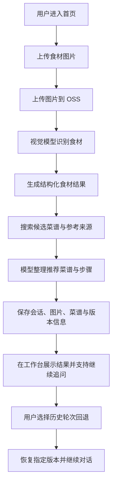

## 1. 产品概述
食材识别菜谱助手是一款面向家庭做饭场景的多模态 Web 应用，用户通过拍照上传食材图片，即可识别原材料、推荐可制作菜品，并获得带参考来源的详细菜谱步骤。
- 产品目标是把你当前仓库中的大模型调用、搜索增强、结构化输出和 SQLite 记忆能力，升级为一个可交互、可回溯、可扩展的完整应用。
- 核心价值是降低“家里现有食材能做什么”的决策成本，并通过记忆用户偏好和历史会话，让推荐越来越个性化。

## 2. 核心功能

### 2.1 用户角色
| 角色 | 使用方式 | 核心权限 |
|------|----------|----------|
| 普通用户 | 直接进入应用使用 | 上传图片、发起问答、查看推荐菜谱、回退历史会话 |

### 2.2 功能模块
1. **首页 / 对话工作台**：食材图片上传、识别结果展示、菜谱推荐、多轮对话区、历史会话侧栏。
2. **会话详情页**：查看某次会话内的图片、识别食材、候选菜谱、详细步骤和引用来源。
3. **系统状态页**：展示 OSS 上传状态、模型调用状态、最近会话摘要和本地存储说明。

### 2.3 页面详情
| 页面名称 | 模块名称 | 功能描述 |
|-----------|----------|----------|
| 首页 / 对话工作台 | 顶部品牌区 | 展示产品名、状态徽标、快速说明和新建会话入口 |
| 首页 / 对话工作台 | 图片上传区 | 支持拖拽、点击上传、本地预览、上传进度和错误提示 |
| 首页 / 对话工作台 | 食材识别面板 | 以标签卡片形式展示识别出的食材、置信度、估算分量和分类 |
| 首页 / 对话工作台 | 菜谱推荐区 | 展示候选菜品、推荐理由、补充食材、耗时和难度 |
| 首页 / 对话工作台 | 详细步骤区 | 展示主推荐菜谱的分步做法、注意事项和引用来源 |
| 首页 / 对话工作台 | 多轮聊天区 | 支持继续追问，例如替换口味、减少辣度、改空气炸锅做法 |
| 首页 / 对话工作台 | 历史侧栏 | 按时间展示历史会话，支持打开某次记录和回退到指定轮次 |
| 会话详情页 | 会话快照区 | 展示该轮对话的图片、识别结果、最终菜谱和元数据 |
| 会话详情页 | 回退控制区 | 选择旧轮次恢复并从该节点继续对话，形成新分支 |
| 系统状态页 | 能力说明区 | 展示当前模型、存储方式、搜索策略和本地数据库信息 |
| 系统状态页 | 最近活动区 | 展示最近会话摘要、最近上传图片和系统自检信息 |

## 3. 核心流程
用户打开应用后上传一张包含原材料的照片，系统先将图片上传到 OSS，再调用视觉模型识别食材并输出结构化结果。随后系统基于识别结果调用搜索工具与菜谱生成链路，整理出候选菜品和详细步骤，同时把会话状态、图片地址、识别结果和菜谱结果持久化到 SQLite。

当用户继续追问时，系统读取相同 `thread_id` 下的上下文和用户偏好，生成更符合口味的回答；当用户选择回退某次聊天时，系统恢复到对应的会话版本节点，并从该节点继续生成新的分支结果。

## 4. 用户界面设计
### 4.1 设计风格
- 设计方向：深色厨房实验室风格，强调“视觉识别 + 菜谱推理”的智能感与烹饪质感。
- 主色：炭黑 `#111315`，辅色：暖白 `#F6F0E8`，强调色：番茄橙 `#E86A33` 与香草绿 `#88B04B`。
- 按钮样式：大圆角、轻拟物阴影、悬停时产生轻微上浮和发光描边。
- 字体建议：标题使用有烹饪杂志质感的衬线字体，正文使用清晰的人文无衬线字体。
- 布局方式：桌面优先的三栏布局，左侧历史会话，中间核心工作台，右侧推荐结果与系统状态。
- 图标风格：使用线性图标，搭配少量食材符号和状态徽标。

### 4.2 页面设计概览
| 页面名称 | 模块名称 | UI 元素 |
|-----------|----------|----------|
| 首页 / 对话工作台 | 顶部品牌区 | 深色渐变背景、状态胶囊、衬线大标题、弱动画扫描线 |
| 首页 / 对话工作台 | 图片上传区 | 大面积拖拽框、预览图、进度条、上传成功动画、材质化边框 |
| 首页 / 对话工作台 | 食材识别面板 | 标签云、置信度条、分类徽章、卡片式列表 |
| 首页 / 对话工作台 | 菜谱推荐区 | 杂志式卡片排版、主推荐高亮、补充食材提示、评分标签 |
| 首页 / 对话工作台 | 多轮聊天区 | 气泡式消息、可视化引用区块、输入框带快捷建议 |
| 会话详情页 | 会话快照区 | 大图预览、摘要信息、时间线、分支标记 |
| 系统状态页 | 能力说明区 | 信息卡、数据库说明、模型名称、健康检查状态 |

### 4.3 响应式设计
- 默认采用桌面优先布局，优先优化 1280px 以上宽屏操作体验。
- 在平板尺寸下收缩为双栏布局，历史侧栏折叠到抽屉。
- 在移动端保留核心上传、推荐和聊天功能，历史会话改为底部抽屉面板。
- 所有上传、聊天和回退操作都保证触屏可点击区域不小于 44px。
