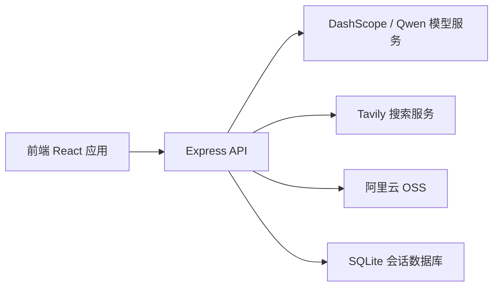
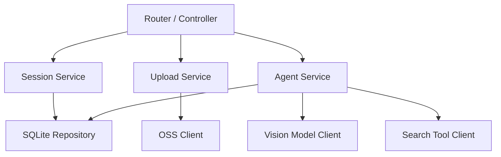
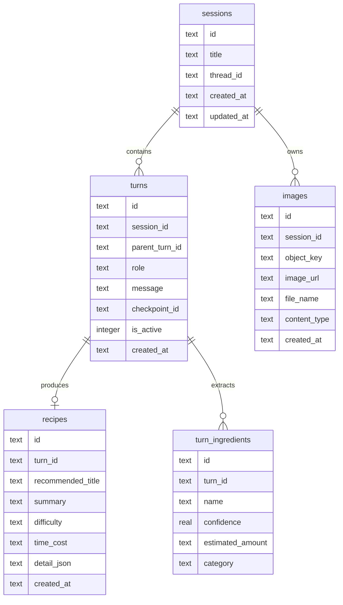

## 1. 架构设计


## 2. 技术说明
- 前端：React 18 + TypeScript + Vite + Tailwind CSS + Zustand
- 后端：Express + TypeScript
- 模型接入：DashScope OpenAI 兼容接口，优先使用支持图片输入的多模态模型完成食材识别
- 搜索增强：Tavily，用于补充公开菜谱来源与做法依据
- 数据存储：SQLite，保存会话、版本、图片元数据、识别结果与菜谱结果
- 对象存储：阿里云 OSS，保存用户上传图片并回传可访问地址
- 状态管理：Zustand 管理当前会话、历史列表、上传状态和系统状态

## 3. 路由定义
| 路由 | 作用 |
|------|------|
| / | 首页 / 对话工作台，完成上传、识别、生成菜谱和多轮聊天 |
| /sessions/:sessionId | 查看指定会话详情与历史轮次 |
| /system | 查看系统状态、能力说明和最近活动 |

## 4. API 定义
```ts
type IngredientItem = {
  id: string
  name: string
  confidence: number
  estimatedAmount: string
  category: string
}

type RecipeCandidate = {
  id: string
  title: string
  summary: string
  difficulty: "简单" | "中等" | "进阶"
  timeCost: string
  extraIngredients: string[]
}

type RecipeDetail = {
  title: string
  summary: string
  tips: string[]
  steps: string[]
  references: { title: string; url: string }[]
}

type SessionSummary = {
  id: string
  title: string
  createdAt: string
  updatedAt: string
  lastMessage: string
  coverImageUrl?: string
}
```

### 4.1 `POST /api/upload-image`
- 作用：接收本地图片并上传 OSS，返回图片元数据。
- 请求：`multipart/form-data`
- 响应：

```ts
{
  imageId: string
  objectKey: string
  imageUrl: string
  fileName: string
  contentType: string
}
```

### 4.2 `POST /api/recognize`
- 作用：基于已上传图片调用视觉模型识别食材。
- 请求：

```ts
{
  imageUrl: string
}
```

- 响应：

```ts
{
  ingredients: IngredientItem[]
  visualSummary: string
}
```

### 4.3 `POST /api/recipes/generate`
- 作用：基于识别结果、用户问题和会话上下文生成候选菜谱与详细步骤。
- 请求：

```ts
{
  sessionId: string
  imageUrl: string
  ingredients: IngredientItem[]
  userPrompt?: string
}
```

- 响应：

```ts
{
  sessionId: string
  turnId: string
  candidates: RecipeCandidate[]
  recommended: RecipeDetail
  assistantMessage: string
}
```

### 4.4 `POST /api/chat`
- 作用：在已有会话中继续追问，利用记忆能力输出新的菜谱建议或调整方案。
- 请求：

```ts
{
  sessionId: string
  message: string
}
```

- 响应：

```ts
{
  turnId: string
  assistantMessage: string
  recommended?: RecipeDetail
}
```

### 4.5 `GET /api/sessions`
- 作用：获取历史会话列表。

### 4.6 `GET /api/sessions/:sessionId`
- 作用：获取某个会话的完整内容、图片、轮次和结果快照。

### 4.7 `POST /api/sessions/:sessionId/revert`
- 作用：回退到指定轮次，并从该轮次继续新分支。
- 请求：

```ts
{
  targetTurnId: string
}
```

- 响应：

```ts
{
  sessionId: string
  activeTurnId: string
  branchFromTurnId: string
}
```

### 4.8 `GET /api/system/status`
- 作用：返回模型、OSS、数据库、最近会话等系统信息。

## 5. 服务端架构图


## 6. 数据模型
### 6.1 数据模型定义


### 6.2 数据定义语言
```sql
CREATE TABLE IF NOT EXISTS sessions (
  id TEXT PRIMARY KEY,
  title TEXT NOT NULL,
  thread_id TEXT NOT NULL UNIQUE,
  created_at TEXT NOT NULL,
  updated_at TEXT NOT NULL
);

CREATE TABLE IF NOT EXISTS images (
  id TEXT PRIMARY KEY,
  session_id TEXT NOT NULL,
  object_key TEXT NOT NULL,
  image_url TEXT NOT NULL,
  file_name TEXT NOT NULL,
  content_type TEXT NOT NULL,
  created_at TEXT NOT NULL
);

CREATE INDEX IF NOT EXISTS idx_images_session_id ON images(session_id);

CREATE TABLE IF NOT EXISTS turns (
  id TEXT PRIMARY KEY,
  session_id TEXT NOT NULL,
  parent_turn_id TEXT,
  role TEXT NOT NULL,
  message TEXT NOT NULL,
  checkpoint_id TEXT,
  is_active INTEGER NOT NULL DEFAULT 1,
  created_at TEXT NOT NULL
);

CREATE INDEX IF NOT EXISTS idx_turns_session_id ON turns(session_id);
CREATE INDEX IF NOT EXISTS idx_turns_parent_turn_id ON turns(parent_turn_id);

CREATE TABLE IF NOT EXISTS turn_ingredients (
  id TEXT PRIMARY KEY,
  turn_id TEXT NOT NULL,
  name TEXT NOT NULL,
  confidence REAL NOT NULL,
  estimated_amount TEXT NOT NULL,
  category TEXT NOT NULL
);

CREATE INDEX IF NOT EXISTS idx_turn_ingredients_turn_id ON turn_ingredients(turn_id);

CREATE TABLE IF NOT EXISTS recipes (
  id TEXT PRIMARY KEY,
  turn_id TEXT NOT NULL,
  recommended_title TEXT NOT NULL,
  summary TEXT NOT NULL,
  difficulty TEXT NOT NULL,
  time_cost TEXT NOT NULL,
  detail_json TEXT NOT NULL,
  created_at TEXT NOT NULL
);

CREATE INDEX IF NOT EXISTS idx_recipes_turn_id ON recipes(turn_id);
```

## 7. 实现决策
- 前端采用单页应用结构，先做高质量工作台与会话详情页，满足 MVP 体验。
- 后端优先采用 Express，便于和 `react-express-ts` 模板整合，减少脚手架与运行复杂度。
- 食材识别与菜谱生成解耦：先识别图片，再生成菜谱，方便调试、缓存和重试。
- 回退机制采用“会话版本 + 父子轮次”模型，而不是直接删除消息，便于保留完整历史分支。
- OSS 上传与模型调用都由后端代理，前端只拿图片地址和结构化结果，减少密钥暴露风险。
